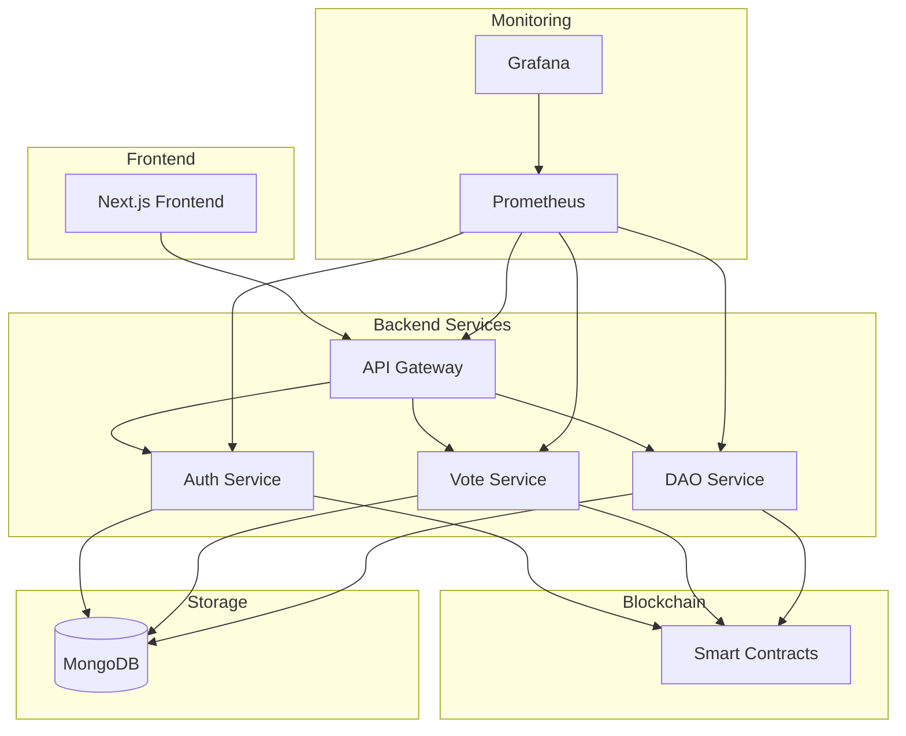

```mermaid
graph TB
    subgraph Frontend
        UI[Next.js Frontend]
    end

    subgraph Backend Services
        API[API Gateway]
        Auth[Auth Service]
        Vote[Vote Service]
        DAO[DAO Service]
    end

    subgraph Blockchain
        SC[Smart Contracts]
    end

    subgraph Storage
        DB[(MongoDB)]
    end

    subgraph Monitoring
        G[Grafana]
        P[Prometheus]
    end

    UI --> API
    API --> Auth
    API --> Vote
    API --> DAO
    
    Auth --> SC
    Vote --> SC
    DAO --> SC
    
    Auth --> DB
    Vote --> DB
    DAO --> DB
    
    P --> API
    P --> Auth
    P --> Vote
    P --> DAO
    G --> P
``` 