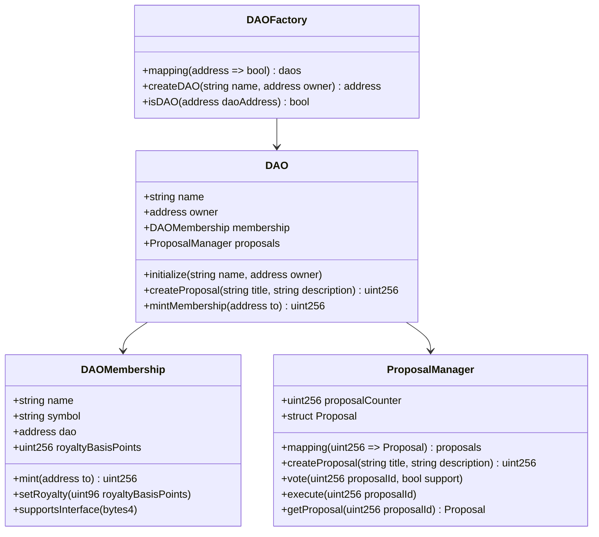

```mermaid
classDiagram
    DAOFactory --> DAO
    DAO --> DAOMembership
    DAO --> ProposalManager

    class DAOFactory {
        +mapping(address => bool) daos
        +createDAO(string name, address owner) address
        +isDAO(address daoAddress) bool
    }
    
    class DAO {
        +string name
        +address owner
        +DAOMembership membership
        +ProposalManager proposals
        +initialize(string name, address owner)
        +createProposal(string title, string description) uint256
        +mintMembership(address to) uint256
    }
    
    class ProposalManager {
        +mapping(uint256 => Proposal) proposals
        +uint256 proposalCounter
        +struct Proposal
        +createProposal(string title, string description) uint256
        +vote(uint256 proposalId, bool support)
        +execute(uint256 proposalId)
        +getProposal(uint256 proposalId) Proposal
    }
    
    class DAOMembership {
        +string name
        +string symbol
        +address dao
        +uint256 royaltyBasisPoints
        +mint(address to) uint256
        +setRoyalty(uint96 royaltyBasisPoints)
        +supportsInterface(bytes4)
    }
```