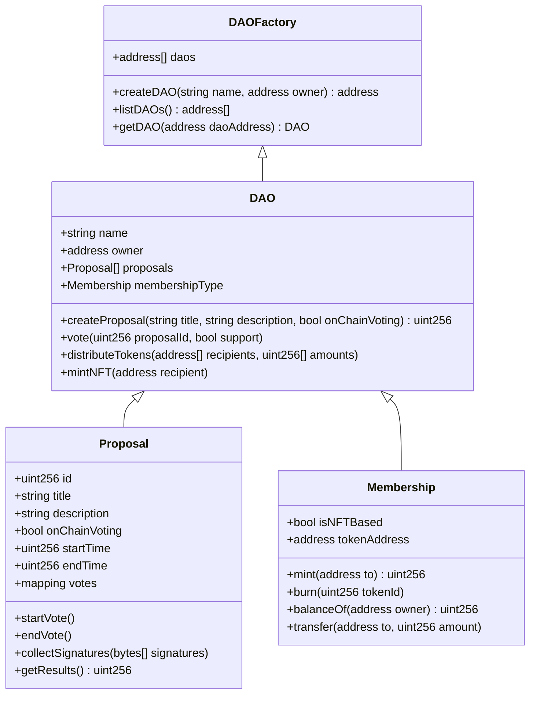

```mermaid
classDiagram
    DAOFactory <|-- DAO
    DAO <|-- Proposal
    DAO <|-- Membership

    class DAOFactory {
        +address[] daos
        +createDAO(string name, address owner) address
        +listDAOs() address[]
        +getDAO(address daoAddress) DAO
    }
    
    class DAO {
        +string name
        +address owner
        +Proposal[] proposals
        +Membership membershipType
        +createProposal(string title, string description, bool onChainVoting) uint256
        +vote(uint256 proposalId, bool support)
        +distributeTokens(address[] recipients, uint256[] amounts)
        +mintNFT(address recipient)
    }
    
    class Proposal {
        +uint256 id
        +string title
        +string description
        +bool onChainVoting
        +uint256 startTime
        +uint256 endTime
        +mapping votes
        +startVote()
        +endVote()
        +collectSignatures(bytes[] signatures)
        +getResults() uint256
    }
    
    class Membership {
        +bool isNFTBased
        +address tokenAddress
        +mint(address to) uint256
        +burn(uint256 tokenId)
        +balanceOf(address owner) uint256
        +transfer(address to, uint256 amount)
    }
```