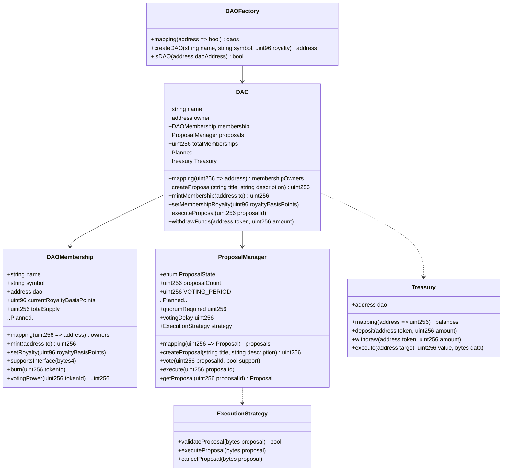

```mermaid
classDiagram
    DAOFactory --> DAO
    DAO --> DAOMembership
    DAO --> ProposalManager
    DAO ..> Treasury
    ProposalManager ..> ExecutionStrategy

    class DAOFactory {
        +mapping(address => bool) daos
        +createDAO(string name, string symbol, uint96 royalty) address
        +isDAO(address daoAddress) bool
    }
    
    class DAO {
        +string name
        +address owner
        +DAOMembership membership
        +ProposalManager proposals
        +mapping(uint256 => address) membershipOwners
        +uint256 totalMemberships
        +createProposal(string title, string description) uint256
        +mintMembership(address to) uint256
        +setMembershipRoyalty(uint96 royaltyBasisPoints)
        ..Planned..
        +treasury Treasury
        +executeProposal(uint256 proposalId)
        +withdrawFunds(address token, uint256 amount)
    }
    
    class ProposalManager {
        +enum ProposalState
        +mapping(uint256 => Proposal) proposals
        +uint256 proposalCount
        +uint256 VOTING_PERIOD
        +createProposal(string title, string description) uint256
        +vote(uint256 proposalId, bool support)
        +execute(uint256 proposalId)
        +getProposal(uint256 proposalId) Proposal
        ..Planned..
        +quorumRequired uint256
        +votingDelay uint256
        +ExecutionStrategy strategy
    }
    
    class DAOMembership {
        +string name
        +string symbol
        +address dao
        +uint96 currentRoyaltyBasisPoints
        +mapping(uint256 => address) owners
        +uint256 totalSupply
        +mint(address to) uint256
        +setRoyalty(uint96 royaltyBasisPoints)
        +supportsInterface(bytes4)
        ..Planned..
        +burn(uint256 tokenId)
        +votingPower(uint256 tokenId) uint256
    }

    class Treasury {
        +address dao
        +mapping(address => uint256) balances
        +deposit(address token, uint256 amount)
        +withdraw(address token, uint256 amount)
        +execute(address target, uint256 value, bytes data)
    }

    class ExecutionStrategy {
        +validateProposal(bytes proposal) bool
        +executeProposal(bytes proposal)
        +cancelProposal(bytes proposal)
    }
```