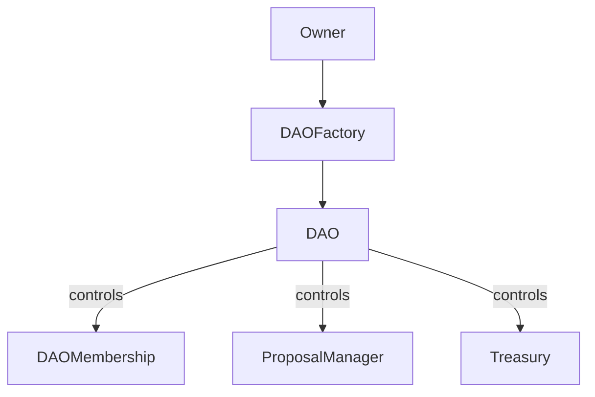

# DAO System Architecture

## Overview

This DAO system implements a flexible and secure decentralized autonomous organization with membership NFTs, proposal management, treasury control, and execution strategies. The system is built with security-first principles and includes multiple safety mechanisms.

> **⚠️ IMPORTANT DISCLAIMER**
>
> This is a practice project created for learning purposes. While it implements OpenZeppelin's Governor contract patterns, it uses a custom implementation for educational purposes rather than the official OpenZeppelin contracts.
>
> This code is provided AS-IS without any warranties or guarantees. It has not been audited and should NOT be used in production. The author assumes no liability for any damages or losses resulting from the use of this code.
>
> For production systems, it is strongly recommended to use the official OpenZeppelin Governor contracts which have been thoroughly tested and audited.

## Core Components

### 1. DAOFactory
Reference: `contracts/src/DAOFactory.sol`

The factory contract manages DAO creation and tracking with the following features:
- Standardized DAO deployment with configurable parameters
- Registry of all created DAOs
- Pausable deployment functionality
- Default governance parameters management

Security features:
- Input validation for all parameters
- ReentrancyGuard for deployment
- Pagination for DAO listing to prevent gas limits
- Owner-controlled emergency pause

### 2. DAO
The main DAO contract coordinates all components and manages:
- Membership NFT control
- Proposal creation and execution
- Treasury operations
- Access control through Ownable pattern

Key security mechanisms:
- Only owner can create proposals
- Modular design for component upgrades
- Event emission for all important actions
- Clear separation of concerns

### 3. DAOMembership (ERC721)
Features:
- Membership NFTs with voting power
- Royalty management
- Pausable transfers
- Burn functionality

Security measures:
- Immutable DAO address
- ReentrancyGuard for minting/burning
- Voting power limits
- Only DAO can mint new tokens
- Pausable for emergencies

### 4. ProposalManager
Manages the governance process with:
- Proposal lifecycle management
- Voting mechanism
- Quorum tracking
- Execution strategy integration

Security features:
- Timelock for execution
- Value limits for transactions
- Quorum requirements
- Vote delegation prevention
- Double-vote protection

### 5. Treasury
Handles all financial operations:
- ETH and ERC20 token management
- Transaction execution
- Balance tracking

Security mechanisms:
- Value limits per transaction
- Timelock for large transactions
- Only DAO can withdraw
- Balance tracking per token

## Security Mechanisms

### Access Control
1. Ownership hierarchy:


2. Function-level protection:
- onlyOwner modifiers
- onlyDAO checks
- Delegation restrictions

### Safety Measures
1. Pausable functionality:
- Emergency pause for all contracts
- Separate pause states per component
- Only owner can pause/unpause

2. Value Limits:
- Maximum transaction values
- Quorum requirements
- Voting power caps

3. Timelocks:
- Proposal execution delay
- Large transaction delays
- Voting periods

### Event Emission
All important state changes emit events for:
- DAO creation/updates
- Membership changes
- Proposal lifecycle
- Voting activities
- Treasury operations

## Deployment Flow

1. Deploy DAOFactory with initial parameters
2. Create new DAO through factory
3. DAO deployment automatically creates:
   - Membership NFT contract
   - Proposal Manager
   - Treasury

## Usage Guidelines

### Creating a DAO
```solidity
// Example DAO creation
DAOFactory factory = DAOFactory(factoryAddress);
address newDao = factory.createDAO(
    "MyDAO",
    "Membership Token",
    "MDAO",
    500 // 5% royalty
);
```

### Proposal Lifecycle
1. Creation: Only DAO owner can create proposals
2. Voting Period: Members vote based on voting power
3. Execution: After timelock and if quorum reached
4. Optional cancellation by DAO owner

### Treasury Management
- Value limits protect against large unauthorized transfers
- Timelocks for significant transactions
- Clear separation between proposal and execution

## Upgradeability

The system is designed with modularity in mind:
- Components can be replaced individually
- State is properly separated
- Clear interfaces between components

## Security Considerations

1. **Rate Limiting**
   - Proposal creation limits
   - Voting power adjustments
   - Transaction value caps

2. **Access Control**
   - Hierarchical permissions
   - Function-level checks
   - Component isolation

3. **Emergency Procedures**
   - System-wide pause
   - Component-level pause
   - Owner override capabilities

## Future Improvements

1. Planned Features:
   - Advanced execution strategies
   - Token-based voting power
   - Multi-signature support

2. Potential Enhancements:
   - Upgradeable contracts
   - More flexible voting mechanisms
   - Enhanced treasury management